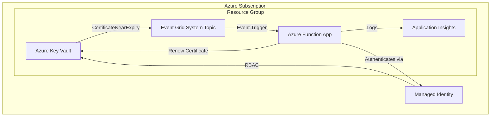
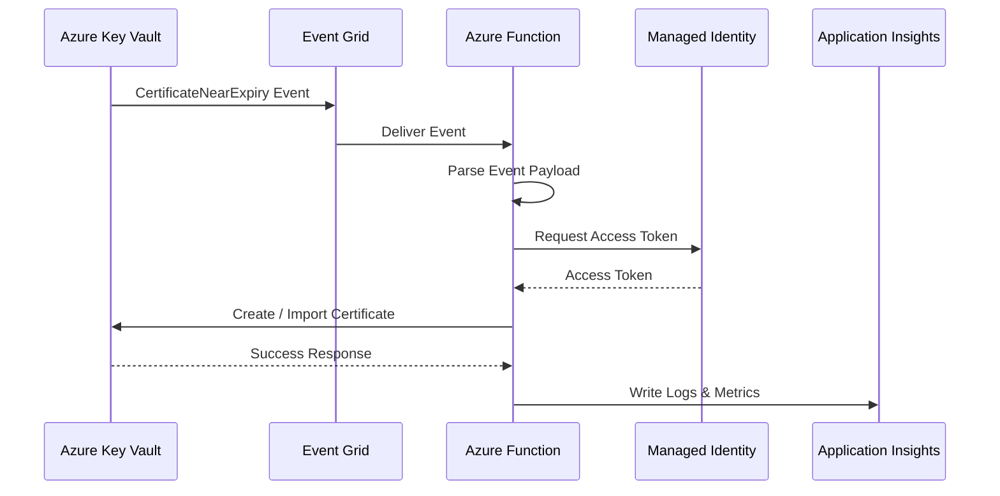
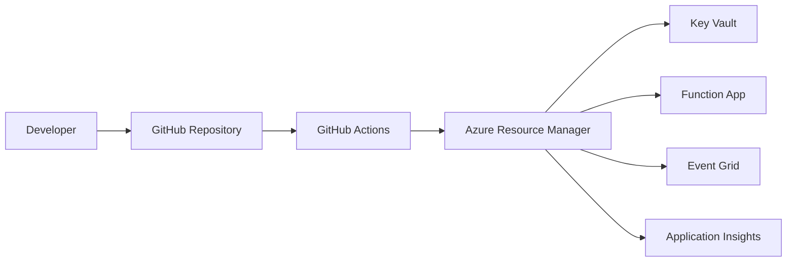
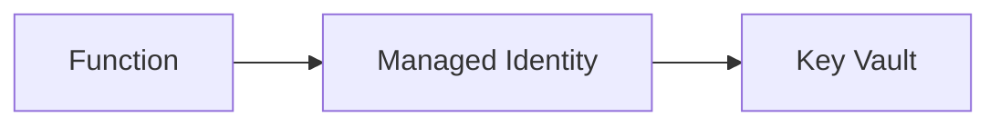
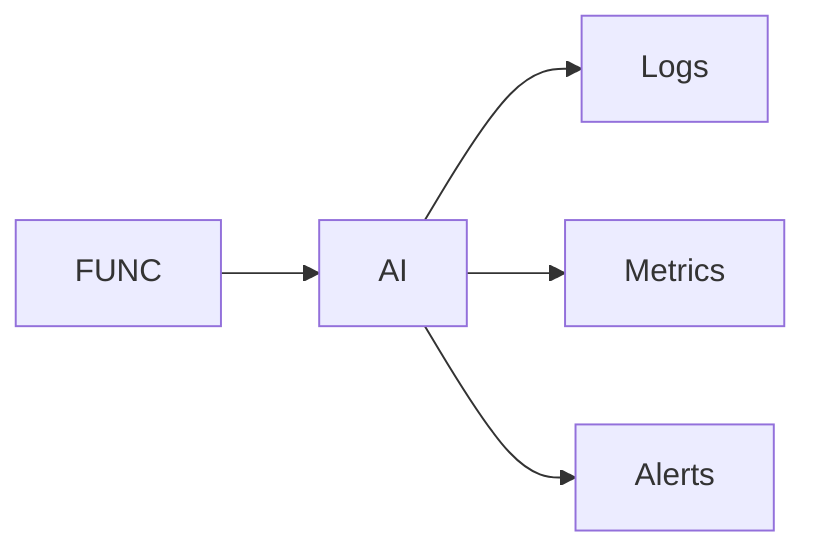

# Architektur

---

## 1. Architekturübersicht

Dieses System automatisiert die Erneuerung von Zertifikaten in Azure Key Vault durch eine ereignisgesteuerte Architektur auf Basis von nativen Azure-Services der Plattform von Microsoft.

Architekturprinzipien:

* Event-driven (kein Polling)
* Secretless Authentication (Managed Identity, OIDC)
* Least Privilege Zugriff
* Environment Isolation
* Fully managed Services (kein Serverbetrieb)

---

## 2. Komponentenübersicht



---

## 3. Laufzeit-Sequenzdiagramm

Dieses Diagramm zeigt den tatsächlichen Runtime-Flow:



---

## 4. Deployment-Architektur

Deployment erfolgt über Infrastructure-as-Code und CI/CD.



---

## 5. Komponentenbeschreibung

### Azure Key Vault

Verantwortlich für:

* Speicherung von Zertifikaten
* Generierung von NearExpiry Events
* Sichere Schlüsselverwaltung

Event wird automatisch erzeugt bei:

```
Microsoft.KeyVault.CertificateNearExpiry
```

---

### Azure Event Grid

Verantwortlich für:

* Empfang von Key Vault Events
* zuverlässige Zustellung an Function
* Retry-Mechanismus bei Fehlern

Vorteile:

* kein Polling notwendig
* guaranteed delivery
* hohe Skalierbarkeit

---

### Azure Function App

Verantwortlich für:

* Verarbeitung des Events
* Zertifikatserneuerung
* Logging

Trigger:

```
EventGridTrigger
```

Aufgaben:

1. Event Payload lesen
2. Zertifikat identifizieren
3. Authentifizierung via Managed Identity
4. Zertifikat erneuern
5. Logging

---

### Managed Identity

Verantwortlich für sichere Authentifizierung ohne Secrets.

Vorteile:

* kein Secret Storage
* kein Secret Rotation notwendig
* automatisch verwaltet

---

### Application Insights

Verantwortlich für:

* Logs
* Fehleranalyse
* Monitoring
* Performance Tracking

Beispiele:

* Function execution count
* failures
* execution time

---

## 6. Event Payload Struktur

Beispiel:

```json
{
  "eventType": "Microsoft.KeyVault.CertificateNearExpiry",
  "subject": "/certificates/my-cert",
  "data": {
    "Id": "https://kv.vault.azure.net/certificates/my-cert"
  }
}
```

Wichtige Felder:

| Feld      | Bedeutung      |
| --------- | -------------- |
| eventType | Event Typ      |
| subject   | Zertifikat     |
| data.Id   | Zertifikat URI |

---

## 7. Sicherheitsarchitektur

Trust-Beziehungen:



Prinzipien:

* kein Secret Storage
* Identity-based access only
* Least privilege

---

## 8. RBAC Modell

| Identity                  | Rolle                          | Scope          |
| ------------------------- | ------------------------------ | -------------- |
| Function Managed Identity | Key Vault Certificates Officer | Key Vault      |
| GitHub OIDC Identity      | Contributor                    | Resource Group |
| GitHub OIDC Identity      | User Access Administrator      | Resource Group |

---

## 9. Fehlerbehandlung und Resilienz

Event Grid bietet:

* automatic retry
* exponential backoff
* dead letter support

Wenn Function fehlschlägt:

```
Event Grid retries automatically
```

System bleibt konsistent.

---

## 10. Skalierungsverhalten

Azure Function skaliert automatisch basierend auf:

* Anzahl Events
* Verarbeitungslast

Skalierungsmodell:

```
0 → N instances automatically
```

Kein manueller Eingriff notwendig.

---

## 11. Monitoring Architektur



Monitoring ermöglicht:

* Fehleranalyse
* Alerting
* Performance Analyse

---

## 12. Environment Isolation

Jede Umgebung besitzt eigene Ressourcen:

| Environment | Resource Group      | Isolation            |
| ----------- | ------------------- | -------------------- |
| dev         | rg-certmgmt-dev     | vollständig isoliert |
| staging     | rg-certmgmt-staging | vollständig isoliert |
| prod        | rg-certmgmt-prod    | vollständig isoliert |

Vorteile:

* keine Cross-Environment Risiken
* sichere Deployments
* klare Trennung

---

## 13. Erweiterbarkeit

Architektur unterstützt Erweiterungen wie:

* mehrere Key Vaults
* mehrere Zertifikate
* zusätzliche Automatisierungen
* Integration mit externen Systemen

Beispiele:

* Slack Notifications
* Teams Notifications
* Monitoring Alerts

---

## 14. Architekturentscheidungen (ADR-Summary)

| Entscheidung                              | Grund                        |
| ----------------------------------------- | ---------------------------- |
| Event Grid statt Polling                  | effizienter, skalierbar      |
| Managed Identity statt Secrets            | höhere Sicherheit            |
| Function statt VM                         | serverless, geringere Kosten |
| Application Insights statt Custom Logging | native Integration           |
| Environment Isolation                     | Sicherheit und Stabilität    |

---

## 15. Zusammenfassung

Diese Architektur bietet:

* vollständig automatisierte Zertifikatserneuerung
* hohe Sicherheit durch Secretless Authentication
* automatische Skalierung
* minimale Betriebskosten
* hohe Zuverlässigkeit
* vollständige Observability